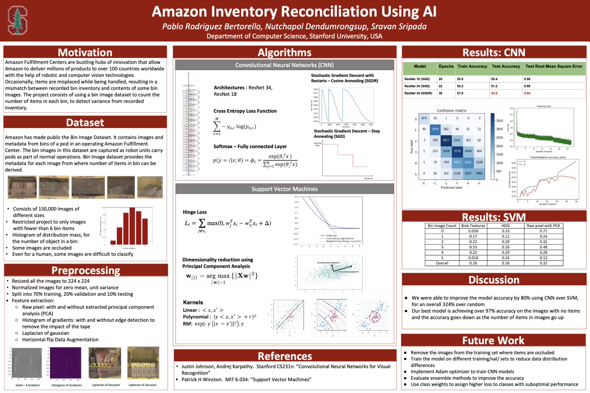

# Amazon Inventory Reconciliation using AI

### Team Members: 
- Pablo Rodriguez Bertorello, Computer Science, Stanford University
- Sravan Sripada, Computer Science, Stanford University
- Nutchapol Dendumrongsup, Computational and Mathematical Engineering, Stanford University

### Abstract
Amazon Fulfillment Centers are bustling hubs of innovation that allow Amazon to deliver millions of products to over 100 countries worldwide. These products are randomly placed in bins, which are carried by robots.
Occasionally, items are misplaced while being handled, resulting in a mismatch: the recorded bin inventory, versus its actual content. The paper describes methods to predict the number of items in a bin, thus detecting any inventory variance. By correcting variance upon detection, Amazon will better serve its customers.

### Report
For details see the project report https://github.com/pablo-tech/AI-Inventory-Reconciliation/blob/master/ProjectReport.pdf

### Summary


### Environment

```
conda env create -f environment.yml
source activate ai-inventory
conda env remove -n ai-inventory
conda info --envs
```
